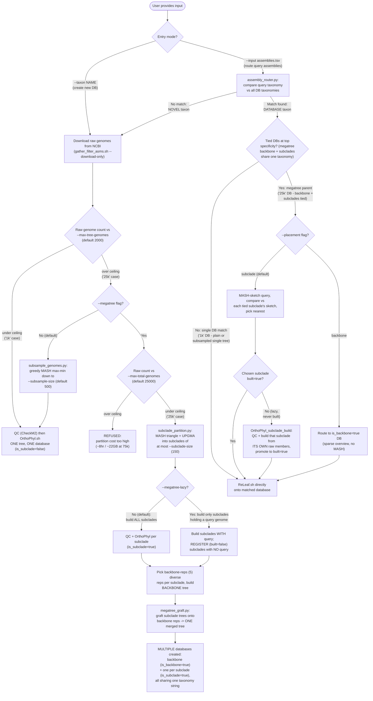

# Routing Workflow Diagram

[← Back to Main README](../README.md)

---

This diagram shows how the wrapper handles the two entry modes (`--taxon` create vs.
`--input` query routing), and how each branches depending on assembly-set scale
(roughly "1k" vs "25k" genomes) and the `--megatree` / `--megatree-lazy` / `--placement`
flags. See `readmes/README_ADVANCED_FEATURES.md` §10 and `readmes/README_PIPELINE_PHASES.md`
for full prose detail on each step.

## Key defaults referenced

| Flag | Default | Meaning |
|---|---|---|
| `--max-tree-genomes` | 2000 | Ceiling for a single tree before capping strategy kicks in |
| `--subsample-size` | 500 | Diverse-subsample target size (default capping strategy) |
| `--max-total-genomes` | 25000 | Ceiling for the opt-in `--megatree` partition step (bounds the O(n²) MASH distance array) |
| `--subclade-size` | 150 | Max genomes per partitioned subclade |
| `--backbone-reps` | 5 | Diverse reps picked per subclade to build the megatree backbone |

## Reading the diagram

- **Novel-taxon branch is shared.** A `--taxon` create run and an unmatched query both
  fall through the same `Download → RawCheck` logic, so "1k vs 25k" plays out
  identically whether it was user-initiated or query-triggered.
- **Database-taxon branch only diverges once a query hits an existing DB.** If that DB
  was built small (~1k, no partitioning), it's a direct ReLeaf. If it was built as a
  megatree (~25k, partitioned), the tie-break/placement/MASH machinery runs first.
- **`--megatree-lazy` defers building, not partitioning.** The MASH triangle + UPGMA
  clustering step always runs up front for `--megatree`; lazy only decides whether an
  individual subclade's tree gets built immediately or registered as `built=false` for
  on-demand construction later.
